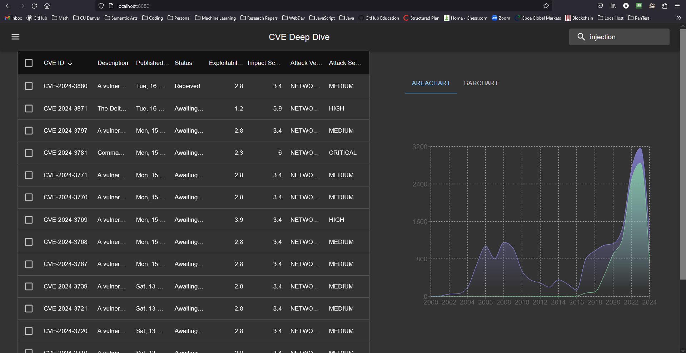
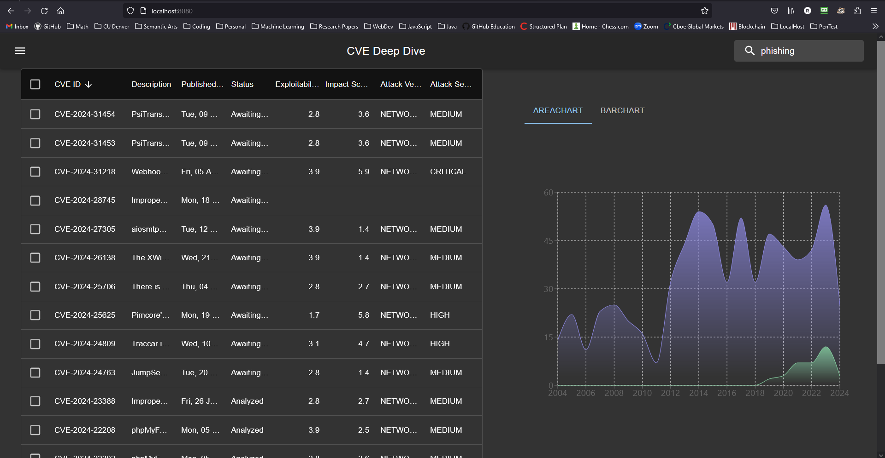
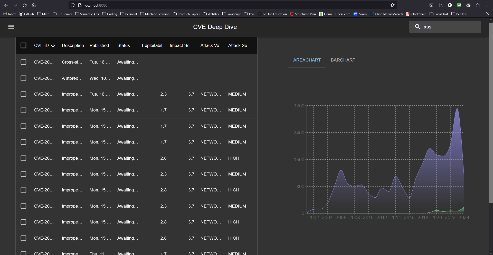
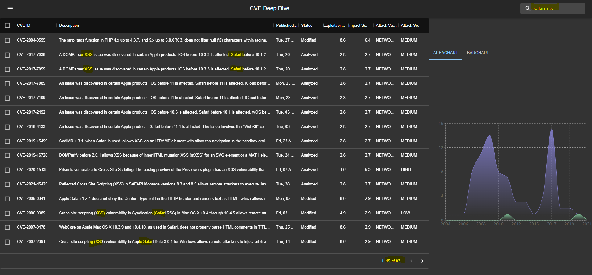
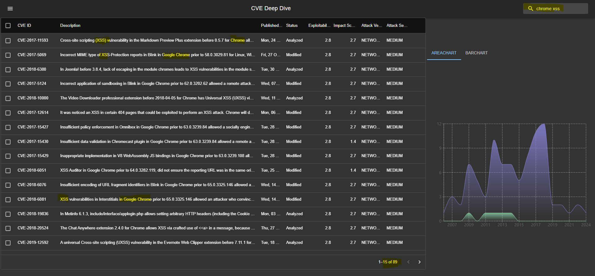
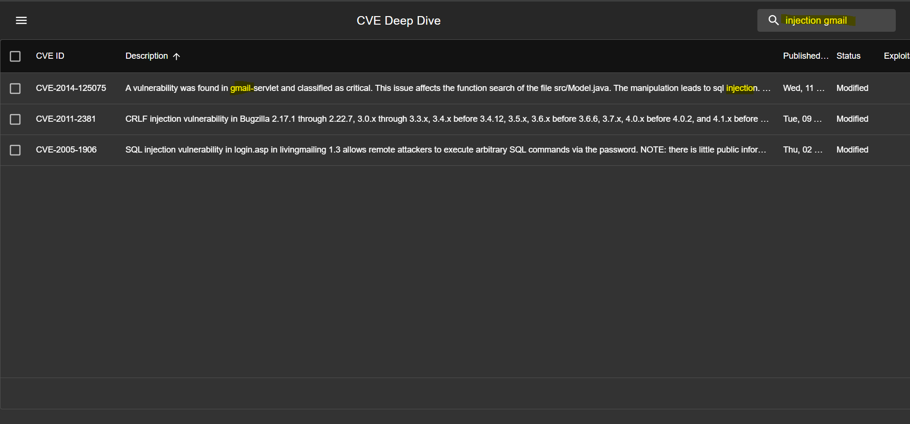
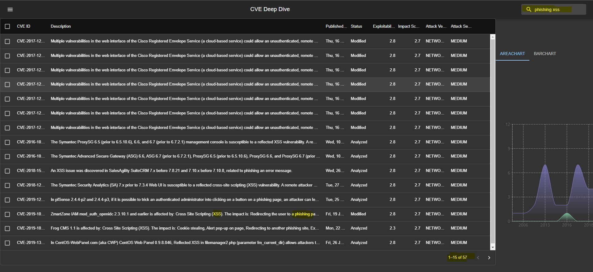
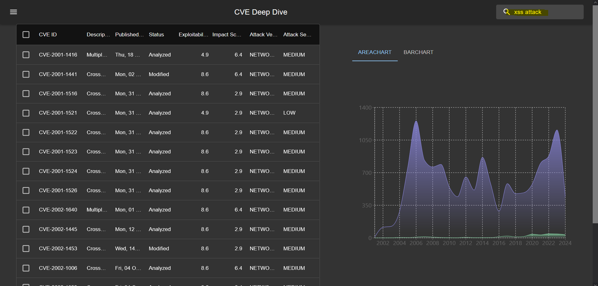

# Vicente Ramos - CyberSecurity Programming

# CSCI 5742

## Website is live at [NVD Deep Dive](https://nvd-deep-dive-43da4b2ca784.herokuapp.com/)

## Setup

Built using React Front End and Python Backend
will need the following:

- Python
  - Flask
- Node
  - React Version 18
  - MUI library (React Front end libray)
  - Recharts

Most if not all of the working components for the Application come from these files! A lot of the other directories and files are created when you first create a React app. I also left some other files in there for when I orignally tried to implement the NLP model with the CVE data.

- dashboard\src\components\Body.js
- dashboard\src\components\Header.js
- dashboard\src\App.js
- flaskbackend.py

### MUI documentation.

https://mui.com/core/
This library was key for making the reactive components that make up the entire website. I used some examples from there to get me started on this library.

Using Node Package manager please install the following libraries/dependencies
"@mui/icons-material":
"@mui/material":
"@mui/x-data-grid"
"recharts"

To get the application running locally we first need to get all the .json data
You need need to get an key for the [NVD API](https://nvd.nist.gov/developers/vulnerabilities), then you can add that key to the fetchData.py and run the script. It will take about 10 minutes to pull all the data.

### `npm run build`

This will bundle the application.

### Please note!

If you happen to make any changes to any of the files inside the dashboard directory (React App) then you will need to run npm run build again to re-bundle your application.

### This definition is from React Website on `npm run build` which is on point

Builds the app for production to the `build` folder.\
It correctly bundles React in production mode and optimizes the build for the best performance.

The build is minified and the filenames include the hashes.\
Your app is ready to be deployed!

### `Python flaskbackend.py`

Yo will need to run this command to POST all of the data to the React front end.

This will run the application backend. The website is hosted at localhost:8080
For more details review the flaskbackend.py

### Final Notes

I left some commented out code and mock data in dashboard\src\components\Body.js to test some of the other graphs that MUI has to offer. Please feel free to use them. Also my code right now pulls a lot more data that is using. The code right now only uses for graphing. So feel free to levarage the existing code to make some cool graphs with the availble data. Enjoy!

## Screenshots with single value search

## Screenshots with multi value search

### After presenting in class, it was suggested by peers and professor to add a feature that would allow users to search for multiple words. I have added this feature, now users can search for two or more words to be found in the description. For example: safari xss. This would help users identify any xss vulnerabilities related to the safari web browser.

